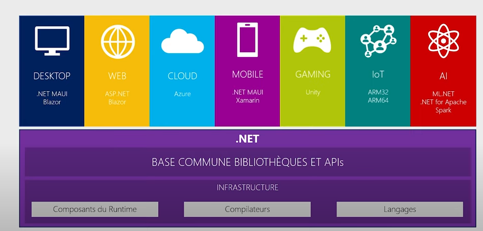

# cour 01 : **Introduction:**

## 1. **Introduction à C# et .NET:**

-   C# (prononcé "C Sharp") est un langage de programmation moderne, orienté objet, développé par Microsoft. Il est largement utilisé pour développer une variété d'applications, allant des applications de bureau aux services web, en passant par les jeux vidéo et les applications mobiles. C# est un langage de haut niveau, facile à apprendre et puissant, ce qui en fait un excellent choix pour les débutants comme pour les développeurs expérimentés.

-   **.NET** est une plateforme de développement open source et multiplateforme créée par Microsoft. Elle permet de créer et d'exécuter une grande variété d'applications, notamment des applications de bureau, des applications web, des services cloud, et des jeux. .NET fournit une infrastructure unifiée pour différents langages de programmation (comme C#, F#, et Visual Basic), facilitant le développement et le déploiement d'applications sur plusieurs systèmes d'exploitation, tels que Windows, Linux, et macOS.

-   Les principaux composants de .NET comprennent :

    -   **CLR (Common Language Runtime)** : Le moteur d'exécution qui gère le code .NET. Il gère la mémoire, l'exécution du code, la sécurité et d'autres services de base.
    -   **BCL (Base Class Library)** : Une vaste collection de bibliothèques qui fournissent des fonctionnalités de base, comme la gestion des fichiers, la manipulation des chaînes de caractères, l'accès aux données, etc.
    -   **ASP.NET** : Un framework pour développer des applications web dynamiques.
    -   **Entity Framework** : Un ORM (Object-Relational Mapper) pour faciliter l'accès aux bases de données.



## 2. **Installation de .NET sur Linux:**

1. **Mise à jour du système :**
   Avant d'installer .NET, il est recommandé de mettre à jour votre système pour s'assurer que toutes les dépendances sont à jour :

    ```bash
    sudo apt-get update
    sudo apt-get upgrade
    ```

2. **Installation de l'outil de gestion des paquets de Microsoft :**
   Pour installer .NET sur Linux, vous devez d'abord ajouter le référentiel de Microsoft à vos sources apt. Pour Ubuntu, par exemple :

    ```bash
    wget https://packages.microsoft.com/config/ubuntu/20.04/packages-microsoft-prod.deb -O packages-microsoft-prod.deb
    sudo dpkg -i packages-microsoft-prod.deb
    sudo apt-get update
    ```

3. **Installation du SDK .NET :**
   Une fois le référentiel ajouté, vous pouvez installer le SDK .NET en utilisant la commande suivante :
    ```bash
    sudo apt-get install dotnet-sdk-7.0
    ```
    Cela installera le SDK (Software Development Kit) de .NET, qui inclut tous les outils nécessaires pour développer, tester et exécuter des applications .NET.

## 3. **Création d'un Nouveau Projet Console:**

Une fois .NET installé, vous pouvez créer un nouveau projet en ligne de commande :

1. **Créer un nouveau projet :**

    ```bash
    dotnet new console -n HelloWorldApp
    ```

    Cette commande crée un nouveau projet console dans un répertoire appelé `HelloWorldApp`.

2. **Naviguer dans le répertoire du projet :**

    ```bash
    cd HelloWorldApp
    ```

3. **Construire et exécuter le projet :**

    ```bash
    dotnet run
    ```

    À ce stade, vous devriez voir la sortie du programme par défaut, qui est généralement "Hello, World!".

## 4. **Exemple de Programme "Hello, World!":**

Le programme "Hello, World!" en C# ressemble à ceci :

```csharp
using System;

namespace HelloWorldApp
{
    class Program
    {
        static void Main(string[] args)
        {
            Console.WriteLine("Hello, World!");
        }
    }
}
```

Ce code définit un programme simple qui utilise la méthode `Console.WriteLine` pour afficher "Hello, World!" dans la console.
