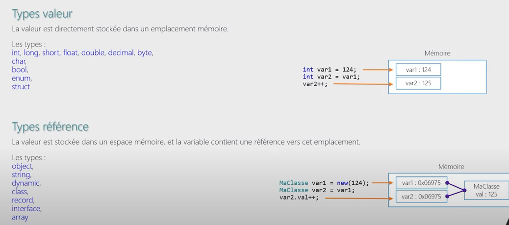

# cour 03 : **Les Types en C# : Types Valeur et Types Référence**

> En C#, les types de données sont divisés en deux grandes catégories : les **types valeur** et les **types référence**. La différence principale entre ces deux types réside dans la manière dont les données sont stockées et manipulées en mémoire.

## 1. **Types Valeur (Value Types):**

-   **Def:**

    > Les **types valeur** stockent directement les données dans la mémoire où la variable est déclarée. Lorsqu'une variable de type valeur est assignée à une autre variable, une copie de la valeur est faite, ce qui signifie que chaque variable a sa propre copie de la donnée.

-   **Principaux types valeur :**

    1. **Types Primitifs** :

        - `int` : Entiers (32 bits)
        - `float` : Nombres à virgule flottante de précision simple (32 bits)
        - `double` : Nombres à virgule flottante de précision double (64 bits)
        - `char` : Caractères (16 bits)
        - `bool` : Booléens (true ou false)

    2. **Structures** (`struct`) :

        - Les structures définies par l'utilisateur sont également des types valeur. Elles peuvent contenir des champs, des méthodes, etc.
        - Exemples : `struct Point { public int x, y; }`

    3. **Types Enumérés** (`enum`) :
        - Les énumérations sont des types valeur spéciaux qui définissent un ensemble de constantes.
        - Exemple : `enum Jour { Lundi, Mardi, Mercredi }`

-   **Exemple :**

    ```csharp
    int a = 10;
    int b = a; // b reçoit une copie de la valeur de a
    b = 20;
    Console.WriteLine(a); // Affiche 10 (a n'est pas affecté par la modification de b)
    ```

    Dans cet exemple, `a` et `b` sont des variables distinctes en mémoire, et la modification de `b` n'affecte pas `a`.

## 2. **Types Référence (Reference Types):**

-   **Def:**

    > Les **types référence** stockent une référence à un emplacement mémoire où les données réelles sont stockées. Lorsque vous assignez une variable de type référence à une autre, vous ne copiez pas les données, mais la référence (l'adresse mémoire) à ces données. Ainsi, plusieurs variables peuvent faire référence au même objet en mémoire.

-   **Principaux types référence :**

    1. **Classes** (`class`) :

        - Les classes définissent des objets qui sont des types référence.
        - Exemples : `class Personne { public string Nom; public int Age; }`

    2. **Chaînes de caractères** (`string`) :

        - Les chaînes sont des types référence, mais se comportent de manière un peu particulière, semblable aux types valeur lorsqu'elles sont manipulées (immuabilité).
        - Exemple : `string texte = "Bonjour";`

    3. **Tableaux** :

        - Les tableaux sont des types référence, même s'ils contiennent des types valeur.
        - Exemple : `int[] nombres = new int[5];`

    4. **Interfaces** :

        - Les interfaces sont des types référence qui définissent un contrat sans implémentation.
        - Exemple : `interface IAnimal { void Parler(); }`

    5. **Délégués** :
        - Les délégués sont des types référence qui permettent de stocker des méthodes et de les passer comme arguments.
        - Exemple : `delegate void MessageHandler(string message);`

-   **Exemple :**

    ```csharp
    class Personne
    {
        public string Nom;
    }

    Personne p1 = new Personne();
    p1.Nom = "Alice";

    Personne p2 = p1; // p2 et p1 pointent vers le même objet en mémoire
    p2.Nom = "Bob";

    Console.WriteLine(p1.Nom); // Affiche "Bob" car p1 et p2 réfèrent au même objet
    ```

    Dans cet exemple, `p1` et `p2` référencent le même objet `Personne` en mémoire. Changer la propriété `Nom` via `p2` affecte aussi `p1`.

## 3. **Différences Clés entre Types Valeur et Types Référence:**

1. **Mémoire** :

    - **Types Valeur** : Stockés sur la pile (stack). La pile gère la mémoire à courte durée de vie et permet un accès rapide.
    - **Types Référence** : Stockés sur le tas (heap). Le tas gère la mémoire à longue durée de vie, mais l'accès est plus lent.

2. **Copie de Données** :

    - **Types Valeur** : La copie d'une variable crée une nouvelle copie des données.
    - **Types Référence** : La copie d'une variable crée une nouvelle référence pointant vers les mêmes données.

3. **Passage de Paramètres** :
    - **Types Valeur** : Passés par valeur, une copie est faite lorsque la méthode est appelée.
    - **Types Référence** : Passés par référence, la méthode peut modifier l'objet original.


